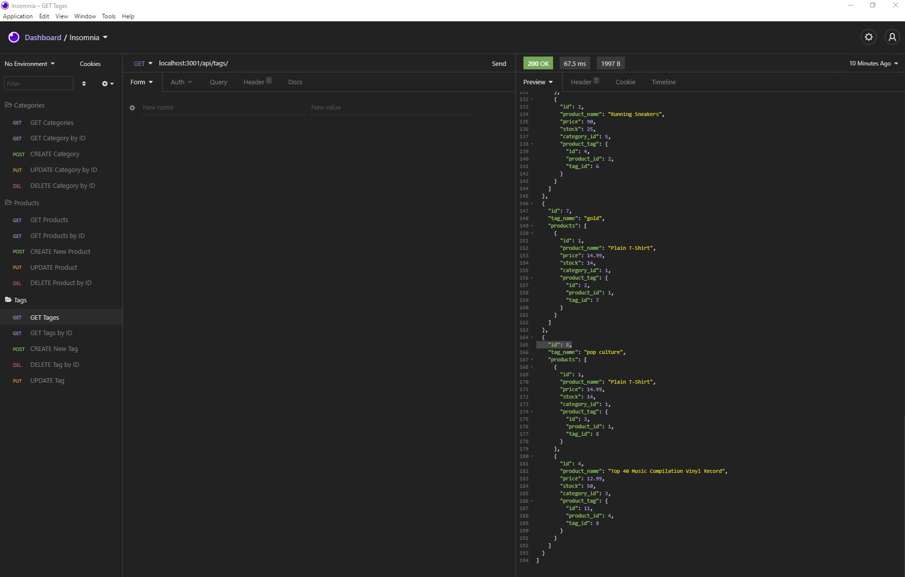

# E-Commerce Backend

[]

A backend for E-commerce website to allow tracking and updating of products for sale.

## Table of Contents

- [Installation](#Installation)
- [Usage](#Usage)
- [License](#License)
- [Contributing](#Contributing)
- [Tests](#Tests)
- [Questions](#Questions)

## Installation

Please follow these steps to ensure a proper installation.
After forking the repo from github, you will need to update the .env file with your Mysql username and password. Open a terminal in VSCode at the root of the application, then run NPM install, you will then need to run the following command "npm start" once the connection is esablished, you will then open insomnia. When Insomnia is open, you will use the following command in Insomnia to verify the connection. "http://localhost:3001/api/products"

## Usage

The following will outline the steps needed to use this project.  
In Insomnia or Postman (I used Insomnia as called out in the README for this assignment)

## License

The MIT License

Please follow the link to learn more about the License this project is protected under.
[https://opensource.org/licenses/MIT](https://opensource.org/licenses/MIT)

## Contributing

How can you contribute?
You can contact me directly via email with any suggestions or updates that will help the app run better.

## Tests

The following test steps can be taken to ensure the project is running correctly.
Currently no test scripts are running on this project, however, you will receive error logs in your terminal if something goes wrong.

## Questions

Please contact me with any questions about this project.

My GitHub URL is [https://github.com/jmalm79](https://github.com/jmalm79)

Email: jmalm79@gmail.com

